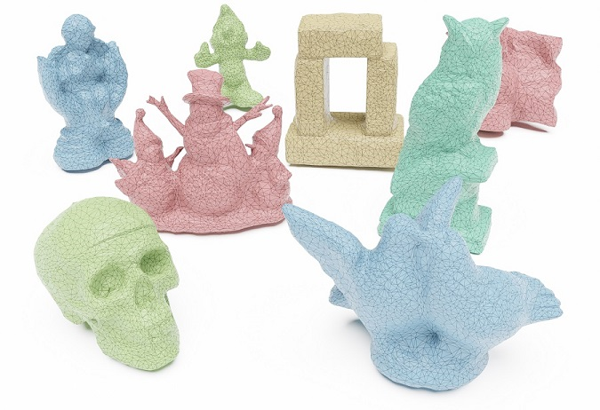

# Neural Deferred Shading

## [Project Page](https://fraunhoferhhi.github.io/neural-deferred-shading) &nbsp;|&nbsp; [Paper](https://mworchel.github.io/assets/papers/neural_deferred_shading_with_supp.pdf) 



Official code for the CVPR 2022 paper "[Multi-View Mesh Reconstruction with Neural Deferred Shading](https://openaccess.thecvf.com/content/CVPR2022/html/Worchel_Multi-View_Mesh_Reconstruction_With_Neural_Deferred_Shading_CVPR_2022_paper.html)", a method for fast multi-view reconstruction with analysis-by-synthesis.

## Installation

Setup the environment and install basic requirements using conda

```bash
conda env create -f environment.yml
conda activate nds
```

### Nvdiffrast

To install [Nvdiffrast](https://github.com/NVlabs/nvdiffrast) from source, run the following in the main directory:

```bash
git clone https://github.com/NVlabs/nvdiffrast.git
cd nvdiffrast
python -m pip install .
```

### pyremesh

Option 1 (preferred): Install [pyremesh](https://github.com/sgsellan/botsch-kobbelt-remesher-libigl) from pre-built packages in the `pyremesh` subdirectory.

From the main directory, run:

```bash
python -m pip install --no-index --find-links ./ext/pyremesh pyremesh
```

Option 2: Install pyremesh from source.

Follow the instructions at https://github.com/sgsellan/botsch-kobbelt-remesher-libigl.

## Reconstructing DTU Scans

Download the sample data [here](https://www.dropbox.com/s/x5hrx26l1pmz1id/data.zip) and unzip the content into the main directory. For example, after unzipping you should have the directory `./data/65_skull`. This dataset contains two samples but we will release the full dataset soon.

To start the reconstruction for the skull, run:
```bash
python reconstruct.py --input_dir ./data/65_skull/views --input_bbox ./data/65_skull/bbox.txt
```
or for a general scan:
```bash
python reconstruct.py --input_dir ./data/{SCAN-ID}_{SCAN-NAME}/views --input_bbox ./data/{SCAN-ID}_{SCAN-NAME}/bbox.txt
```

You will find the output meshes in the directory `./out/{SCAN-ID}_{SCAN-NAME}/meshes`.

## Reconstructing Custom Scenes

Our pipeline expects the input data in a specific structure, which you have to follow for your own scenes.

### Views (--input_dir)

The main input is a folder with *views*, where each view consists of an RGB(A) image and the corresponding camera pose and camera intrinsics. An example folder with N views could look like this (the views do not have to be numbered and can have any file names):

```bash
📂views
├─🖼️1.png
├─📜1_k.txt
├─📜1_r.txt
├─📜1_t.txt
⋮
├─🖼️N.png
├─📜N_k.txt
├─📜N_r.txt
└─📜N_t.txt
```

If present, the alpha channel of the image is used as object mask.

The files `..._k.txt`, `..._r.txt`, and `..._t.txt` contain numpy-readable arrays with the camera pose (R, t) and intrinsics (K) in the **standard OpenCV format**, so K and R are 3x3 matrices and t is a 3-dimensional column vector.

### Bounding Box (--input_bbox)

Another input to our pipeline is a bounding box of the scene. The bounding box is described by a single text file, which contains a numpy-readable array of size 2x3. The first row has the xyz coordinates of the minimum point and the second row those of the maximum point. 

For example, if the bounding box is a cube with side length 2 centered at (0, 0, 0), then `bbox.txt` would simply contain
```bash
-1 -1 -1
 1  1  1
```

### Initial Mesh (--initial_mesh)

If you would like to start your reconstruction from a custom initial mesh instead of using one of the pre-defined options, you need to provide its path. The mesh file can have any standard format (obj, ply, ...). We use [`trimesh`](https://trimsh.org/) for loading, so check their list of supported formats.

### Customizing Loading Routines

If you want to tinker with our data loading routines to adapt them to your format, have a look at `nds.utils.io.read_views()` and `nds.core.view.View.load()`.

## Citation

If you find this code or our method useful for your academic research, please cite our paper

```bibtex
@InProceedings{worchel:2022:nds,
      author    = {Worchel, Markus and Diaz, Rodrigo and Hu, Weiwen and Schreer, Oliver and Feldmann, Ingo and Eisert, Peter},
      title     = {Multi-View Mesh Reconstruction with Neural Deferred Shading},
      booktitle = {Proceedings of the IEEE/CVF Conference on Computer Vision and Pattern Recognition (CVPR)},
      month     = {June},
      year      = {2022},
      pages     = {6187-6197}
}
```

## Troubleshooting

### CUDA Out of Memory

The reconstruction can be quite heavy on GPU memory and in our experiments we used a GPU with 24 GB.

The memory usage can be reduced by reconstructing with a smaller image resolution. Try passing `--image_scale 2` or `--image_scale 4` to `reconstruct.py`, which uses 1/2th or 1/4th of the original resolution. Expect lower memory consumption and better runtime but degraded reconstruction accuracy.

### Reconstruction Hangs at Remeshing

While the remeshing step can take some time especially at higher mesh resolutions, it sometimes hangs indefinitely. This issue comes from calling the function `remesh_botsch` in the `pyremesh` package, which does not return.

For now, the reconstruction has to be aborted and restarted.
